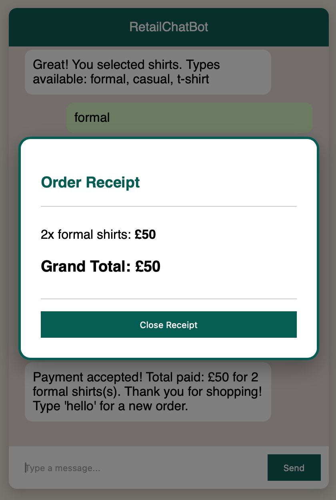

# 🛍️ AI-Powered Retail Chatbot

[](https://www.python.org/) 
[](https://flask.palletsprojects.com/)
[](https://www.mongodb.com/)

## 📌 Overview

This project is an **AI-powered Retail Chatbot** built using **Python, Flask, and Machine Learning**. It allows users to interact with a chatbot to order products (shirts, trousers, jackets), manage a cart, and simulate payments. The chatbot uses **NLP (Natural Language Processing)** via Keras + NLTK to understand user queries and guide the conversation.

---

## 🚀 Features

* Step-based conversation flow
* Product selection with types
* Quantity handling
* Cart management
* Payment simulation
* Receipt generation (popup)
* MongoDB order storage
* NLP-based chatbot (Keras + NLTK)

---

## 🛠️ Technologies Used

- **Python 3.11**  
- **Flask** for web app backend  
- **MongoDB** for database storage  
- **TensorFlow / Keras** for NLP model  
- **NLTK** for text preprocessing  
- **HTML, CSS, JavaScript** for frontend 

---

## 📂 Project Structure

```
AI_Chatbot_Project/
│── app.py # Flask app with chatbot routes
│── chatbot.py # Chatbot NLP processing
│── train.py # Model training script
│── intents.json # Chatbot intents and responses
│── model.h5 # Trained model (ignored in Git)
│── tokenizer.pkl # Tokenizer (ignored in Git)
│── requirements.txt
│── README.md
│── .env # Contains MONGO_URI & FLASK_SECRET_KEY (ignored)
│── templates/
│ └── index.html
```

---

## ⚙️ Installation

1. Clone the repository:

```
git clone https://github.com/your-username/retail-chatbot.git
```

2. Create and activate virtual environment

```
python3 -m venv venv
source venv/bin/activate   # Mac/Linux
venv\Scripts\activate      # Windows
```

3. Install dependencies:

```
pip install -r requirements.txt
```
4. Create .env file

MONGO_URI=your_mongodb_uri
FLASK_SECRET_KEY=sk123

5. Run the app:

```
python app.py
```

---

## 🌐 Usage

* Open browser at:

```
http://127.0.0.1:5050
```

* Type **"hello"** to start chatbot
* Follow steps to order products

## 📸 Screenshots & Demo

### Model Training


### Start of Conversation


### Products List


### Order & Payment


### Receipt / Payment


### Terminal Output


### Video Demo
[](screenshots/Video%20Demo.mp4)


---

## 💾 Database

MongoDB is used to store:

* Orders
* Cart items
* Payment details

---

## 📸 Future Improvements

* Add real payment integration
* Improve NLP accuracy
* Deploy on cloud (AWS / Heroku)

---

## 👨‍💻 Author

**Awais Irshaad**
